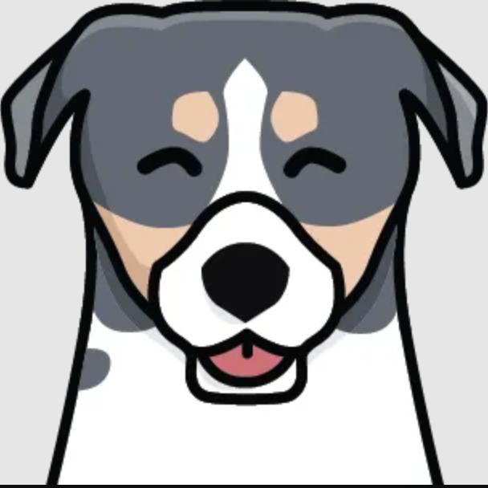

<!-- Improved compatibility of back to top link: See: https://github.com/othneildrew/Best-README-Template/pull/73 -->
<a name="readme-top"></a>
<!--
*** Thanks for checking out the Best-README-Template. If you have a suggestion
*** that would make this better, please fork the repo and create a pull request
*** or simply open an issue with the tag "enhancement".
*** Don't forget to give the project a star!
*** Thanks again! Now go create something AMAZING! :D
-->


<!-- PROJECT SHIELDS -->
<!--
*** I'm using markdown "reference style" links for readability.
*** Reference links are enclosed in brackets [ ] instead of parentheses ( ).
*** See the bottom of this document for the declaration of the reference variables
*** for contributors-url, forks-url, etc. This is an optional, concise syntax you may use.
*** https://www.markdownguide.org/basic-syntax/#reference-style-links
-->

<!-- PROJECT LOGO -->
<br />
<div align="center">
  <a href="https://github.com/github_username/repo_name">
    
  </a>

<h3 align="center">Kona Dashboard For Admins</h3>

  <p align="center">
    A simple, clean dashboard that explores using Kona from an "admin" perspective.
    <br />
    <a href="https://github.com/github_username/repo_name"><strong>Explore the docs »</strong></a>
    <br />
  </p>
</div>


<!-- ABOUT THE PROJECT -->
## About The Project

[![Product Name Screen Shot][product-screenshot]]

Based on: https://www.heykona.com/
### The Problem
Kona (at the time of this project) is a daily emotional check-in for teams where users check in with a red 🔴, yellow 💛, or green 💚 heart, an optional emoji (ie “grateful”, “tired”, “anxious”), and an optional text elaboration. Often, team members share about their work and outside-of-work wins and frustrations.
As Kona expanded to multiple teams within companies, one of the key customer segments they aimed to provide value to were “admins”. Admins were defined as either a **manager of managers** (directly or indirectly oversees more than 1 team), or **People Ops/CXOs** (is responsible for the wellbeing of the entire company).

### The Goal
Use red-yellow-green (RYG) data to create a simple MVP dashboard view to inform admins on well-being in their organization.

### The Solution
A dashboard with a birds-eye-view of all teams across the organization; each team is assigned weekly status, overall status, and a short report on how they are doing.

What is the status? Teams are marked by a red, yellow, or green status symbol which represent how they are feeling mentally.  Statuses are calculated from the RYG data and provide value to admins by easily delineating the teams closest to burnout or that need special assistance.
What is the weekly status? This is how the team is doing that week. Useful for catching short-term issues and checking how teams are feeling during stressful times at the company.
What is the overall status? This shows in what direction the team tends to trend.  This is a useful indicator over time of larger, more fundamental problems with the team.
What is the report? The report is a more personal, in-depth look at a team's status.  It includes a short explanation of how the team is doing, along with snippets from the team's weekly check-in.  Trust is a fundamental part of the Kona experience and it's important that Kona users feel safe sharing their day-to-day with the team. For this reason, only pieces of the what team members are saying are provided to admins and the users' names are not included for some degree of anonymity.  If it looks like a team is in need of help, a contact link is included so that admins can directly coordinate with the team's manager on how best to assist.

The code itself is a Node.js + Express backend/API that parses the CSV file, then sends information to the frontend after the frontend calls its /teamInfo endpoint. The frontend is in React + MaterialUI and displays the backend info accordingly.

If you make changes to the code locally, the project should compile/reload with the updated changes. It runs on nodemon/webpack for the frontend/backend respectively.

### The Future
Future iterations would include "pinning" teams so that high-priority/new teams get first priority for review, as well as a more visual barometer of how teams are faring across the org.

<p align="right">(<a href="#readme-top">back to top</a>)</p>


### Built With
[![React][React.js]][React-url]
[![MaterialUI][Material-UI]][Material-UI-url]
[![Express][Express.js]][Express-url]
[![Node][Node.js]][Node-url]


<p align="right">(<a href="#readme-top">back to top</a>)</p>


<!-- GETTING STARTED -->
## Getting Started

To get a local copy up and running follow these simple steps.

### Prerequisites

Below are the prerequisites you'll need before running the project locally.
* npm
  ```sh
  npm install npm@latest -g
  ```

### Installation

1. Clone the repo
   ```sh
   git clone https://github.com/dramaswamyy/kona-dashboard.git
   ```
2. Next, download the CSV file used for this project (rygs.csv).  You should already own this or it has been shared with you via a GitHub Gist.  The csv file should be added to the ROOT of the folder under kona-dashboard.
3. Install npm packages. If you run into any errors that seem dependency-related, just npm install + the error... for ex. npm install react-scripts.
   ```sh
   npm install
   ```
4. Open two terminal tabs.
5. Ensure you are in the root directory of the repo (kona-dashboard). Run the backend first in the first terminal tab. The console message should inform you the server is listening at localhost:8000.
   ```sh
   npm start
   ```
6. Switch to the second terminal tab. Switch into the UI directory.
   ```sh
   cd ui/kona-dashboard-frontend
   ```
7. Run the frontend in the second terminal tab. It should run on localhost:3000 and use the proxy to redirect API requests to localhost:8000. If you see any errors in terminal related to the proxy, the frontend/backend may not have been started in the correct order. Cut the process and try again! 
   ```sh
   npm start
   ```
Congrats, you've successfully run the project :partying_face:

<p align="right">(<a href="#readme-top">back to top</a>)</p>


<!-- USAGE EXAMPLES -->
## Usage

Example of a report generated for a team that uses Kona:
[![Report View 1][report-1]]

Example of a report generated for a team that doesn't use Kona often:
[![Report View 2][report-2]]

<p align="right">(<a href="#readme-top">back to top</a>)</p>


<!-- MARKDOWN LINKS & IMAGES -->
<!-- https://www.markdownguide.org/basic-syntax/#reference-style-links -->
[product-screenshot]: images/dashboard-view.png
[report-1]: images/report-1.png
[report-2]: images/report-2.png
[Next.js]: https://img.shields.io/badge/next.js-000000?style=for-the-badge&logo=nextdotjs&logoColor=white
[Next-url]: https://nextjs.org/
[React.js]: https://img.shields.io/badge/React-20232A?style=for-the-badge&logo=react&logoColor=61DAFB
[React-url]: https://reactjs.org/
[Express.js]: https://img.shields.io/badge/Express.js-404D59?style=for-the-badge
[Express-url]: https://expressjs.com/
[Node.js]: https://img.shields.io/badge/Node.js-43853D?style=for-the-badge&logo=node.js&logoColor=white
[Node-url]: https://nodejs.org/
[Material-UI]: https://img.shields.io/badge/Material--UI-0081CB?style=for-the-badge&logo=material-ui&logoColor=white
[Material-UI-url]: https://mui.com/
